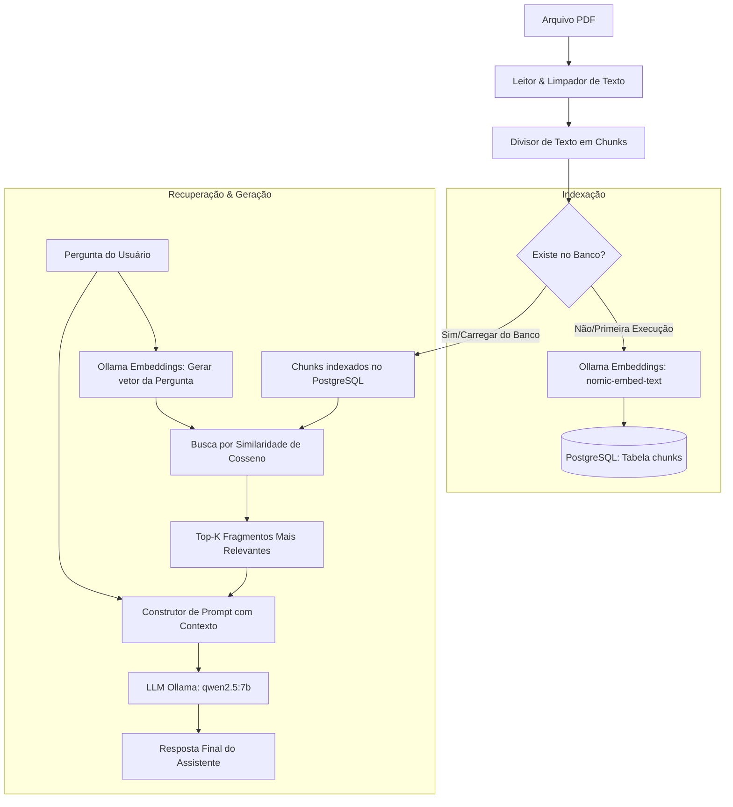

# Atlas AI 🌍🤖

**Atlas AI** é um pipeline profissional de **Geração Recuperada por Contexto (RAG - Retrieval-Augmented Generation)** projetado para indexação, busca semântica e resposta a perguntas baseadas em documentos PDF. O sistema combina o poder de embeddings locais, armazenamento persistente em banco de dados relacional e grandes modelos de linguagem (LLMs) executados localmente.

---

## 🚀 Funcionalidades

- **Leitura & Limpeza de PDF:** Extração de texto altamente eficiente usando o `PyMuPDF` (`fitz`), seguida de uma sanitização inteligente que elimina ruídos e quebras de linha indesejadas.
- **Chunking Dinâmico:** Divisão de texto em blocos (chunks) estruturados com sobreposição configurável (overlap) para preservar o contexto semântico entre fragmentos consecutivos.
- **Embeddings Semânticos Locais:** Geração de vetores usando a API do **Ollama** com o modelo de alta performance `nomic-embed-text`.
- **Persistência Relacional:** Armazenamento robusto dos chunks e embeddings vetorizados em um banco de dados **PostgreSQL** utilizando o tipo `JSONB` para consultas futuras extremamente rápidas.
- **Busca por Similaridade de Cosseno:** Algoritmo implementado nativamente para calcular a similaridade matemática entre a consulta do usuário e os blocos de texto armazenados.
- **Prompt Engineering Contextual:** Estruturação avançada de prompts que restringem a resposta do modelo estritamente aos fatos fornecidos nos blocos recuperados.
- **Geração Inteligente de Respostas:** Integração local via Ollama utilizando o modelo de linguagem `qwen2.5:7b` para respostas em linguagem natural altamente precisas.

---

## 🏗️ Arquitetura do Sistema

O fluxo de processamento do Atlas AI é descrito na arquitetura abaixo:



---

## 📂 Estrutura do Projeto

```text
atlas-ai/
├── app/
│   ├── database/          # Conexão e scripts SQL do PostgreSQL
│   ├── embeddings/        # Interface de geração de embeddings via Ollama
│   ├── generator/         # Interface de geração de texto do LLM (Ollama)
│   ├── pdf/               # Módulos para leitura e sanitização de PDFs
│   ├── prompts/           # Construtor e gerenciador de prompts
│   ├── rag/               # Lógica de Chunking e algoritmo de Retrieval (Similaridade)
│   ├── repositories/      # Repositórios de dados para abstração do PostgreSQL
│   ├── service/           # Orquestração principal do pipeline (Atlas Service)
│   └── utils/             # Utilitários de suporte do sistema
├── data/
│   └── pdfs/              # Pasta sugerida para armazenamento dos arquivos PDF
├── tests/                 # Conjunto de testes automatizados com pytest
├── .env.example           # Exemplo de variáveis de ambiente
├── requirements.txt       # Dependências Python do projeto
├── main.py                # Interface de linha de comando (CLI) e ponto de entrada
└── README.md              # Documentação oficial do projeto
```

---

## ⚙️ Pré-requisitos

Para rodar o projeto localmente, você precisará de:

1. **Python 3.10 ou superior**
2. **PostgreSQL** instalado e ativo
3. **Ollama** instalado e rodando em sua máquina:
   - Certifique-se de baixar os modelos necessários executando:
     ```bash
     ollama pull nomic-embed-text
     ollama pull qwen2.5:7b
     ```

---

## 🔧 Instalação e Configuração

### 1. Clonar o Repositório e Configurar Ambiente
Navegue até a pasta do projeto, crie e ative um ambiente virtual:

```bash
# Criar ambiente virtual
python -m venv .venv

# Ativar ambiente virtual (Linux)
source .venv/bin/activate

# Instalar dependências
pip install -r requirements.txt
```

### 2. Configurar Variáveis de Ambiente
Copie o arquivo de exemplo de ambiente e preencha com as credenciais do seu banco de dados PostgreSQL:

```bash
cp .env.example .env
```

Abra o arquivo `.env` e configure suas variáveis:
```env
DB_HOST=localhost
DB_DATABASE=seu_banco_de_dados
DB_USER=seu_usuario
DB_PASSWORD=sua_senha
```

### 3. Estruturar o Banco de Dados
Crie as tabelas necessárias no banco utilizando o script fornecido em `app/database/schema.sql`. Você pode executar este comando no seu terminal do PostgreSQL ou utilizar uma ferramenta visual (como DBeaver ou pgAdmin):

```sql
CREATE TABLE IF NOT EXISTS chunks (
    id SERIAL PRIMARY KEY,
    chunk_id VARCHAR(255) UNIQUE NOT NULL,
    page INTEGER,
    source VARCHAR(255),
    content TEXT NOT NULL,
    embedding JSONB NOT NULL,
    created_at TIMESTAMP DEFAULT CURRENT_TIMESTAMP
);
```

---

## 💻 Como Usar

O Atlas AI expõe uma interface de linha de comando (CLI) simples e direta através do arquivo `main.py`.

### Fluxo de Execução
1. **Indexação:** Se o banco de dados PostgreSQL estiver vazio, o pipeline lerá o arquivo PDF fornecido, o dividirá em chunks, gerará os embeddings e salvará os dados no banco de dados automaticamente.
2. **Busca e Resposta:** Se o banco já contiver dados previamente indexados, ele carregará esses chunks para realizar a busca semântica veloz, evitando a re-indexação desnecessária do documento.

### Exemplos de Comandos

**Pergunta Básica com 3 resultados retornados (Padrão):**
```bash
python main.py data/pdfs/seu_documento.pdf "Quais são as principais conclusões deste relatório?"
```

**Definindo a quantidade customizada de Chunks retornados (`--top_k`):**
```bash
python main.py data/pdfs/seu_documento.pdf "Explique a metodologia descrita na página 12" --top_k 5
```

---

## 🧪 Testes Automatizados

O projeto utiliza o framework `pytest` para testes unitários. Para rodar a suíte de testes de RAG e validação do pipeline:

```bash
PYTHONPATH=. .venv/bin/pytest
```

---

## 🛠️ Tecnologias Utilizadas

- **[Python](https://www.python.org/):** Linguagem de programação principal.
- **[Ollama](https://ollama.com/):** Engine para rodar LLMs e embeddings locais.
- **[PyMuPDF (fitz)](https://pymupdf.readthedocs.io/):** Biblioteca para manipulação e extração veloz de texto em PDFs.
- **[PostgreSQL](https://www.postgresql.org/):** Sistema de gerenciamento de banco de dados relacional.
- **[psycopg2](https://www.psycopg.org/):** Adaptador de banco de dados PostgreSQL para Python.
- **[pytest](https://docs.pytest.org/):** Framework de testes.

Ainda em desenvolvimento!
